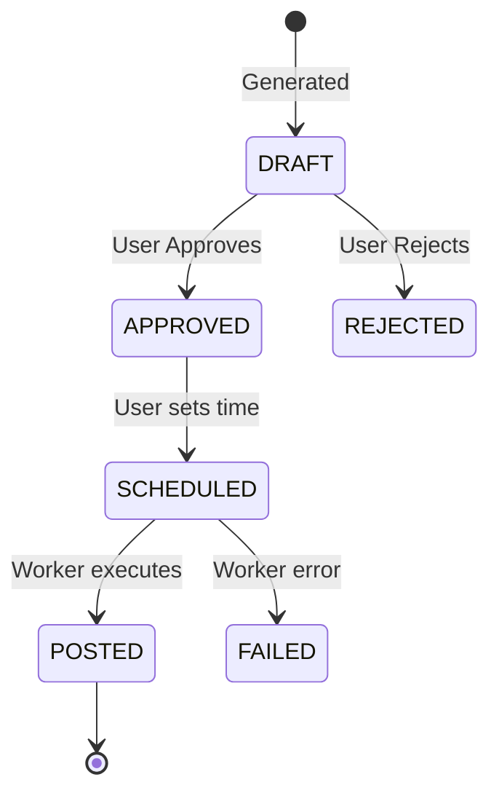

# SocialSprout MVP Specification

## 1. Goals & Non-Goals

### Goals
- **End-to-End Workflow**: Enable small businesses to go from onboarding to scheduled social media posts.
- **Provider Abstraction**: Design a robust interface for generation providers so specific implementations (Freepik/Claude) can be swapped or stubbed without affecting the core app.
- **MVP Reliability**: Ensure the "happy path" (Generate -> Approve -> Schedule) works flawlessly with stubbed data.
- **Platform Expansion**: Structure data to support future platforms (Pinterest) even if only IG/FB are supported now.
- **Monetization (Automated)**: Integrate x402 for automated payment/credit management.
- **Budget Control**: Allow users to set specific spending limits per generation run.
- **Simulated Posting**: Simulate the posting action via a worker state change (stubbed integration).

### Non-Goals
- **Real-time Posting**: Actual integration with FB/IG APIs is out of scope for MVP v1.
- **Complex Editing**: No image editor or advanced text editing. Just simple approval/regeneration.
- **User Ops/Auth**: Simple auth is fine.

## 2. User Flows

### Flow 1: Unified Create & Generate
1. **Input Interface**: User lands on the "New Campaign" screen.
    - **Brand**: Name, Category, Description.
    - **Campaign**: Goal, Platforms.
    - **Generation**: Select Style, Set Budget.
    - **Assets**: Upload product images (orphaned initially, linked on create).
2. **Action**: User clicks "Generate Drafts".
    - **Payment**: System checks budget against x402.
3. **Processing**:
    - System creates `Campaign`.
    - Assets are linked to the new Campaign.
    - System triggers `GenerationRun`.
4. **Review**: User moves to the Review screen with 3 generated drafts.

### Flow 2: Review & Schedule
1. **Review**: User sees 3 drafts.
2. **Action**: User can "Approve" a draft or "Reject".
3. **Refinement (Optional)**: User might edit caption text before approving.

### Flow 4: Scheduling & Posting (Simulation)
1. **Schedule**: For an approved post, User selects a date/time.
2. **Confirm**: Status changes to `SCHEDULED`.
3. **Background Job**: A worker (simulated) picks up items past their due date.
4. **Execute**: Worker marks status as `POSTED`.

## 3. Data Entities

### Campaign
- `id`: UUID
- `brandName`: string
- `brandCategory`: Enum (LifestyleProduct, ConsumerProduct, Place, Service)
- `brandDescription`: text
- `goal`: text
- `platforms`: Array<Enum(Instagram, Facebook, Pinterest)>
- `status`: Enum (DRAFT, PAID, COMPLETED)

### Asset
- `id`: UUID
- `campaignId`: UUID (nullable during upload, linking happens at campaign creation)
- `url`: string
- `type`: Enum (IMAGE)
- `createdAt`: DateTime

### Post
- `id`: UUID
- `campaignId`: UUID
- `status`: Enum (DRAFT, APPROVED, SCHEDULED, POSTED, FAILED)
- `scheduledTime`: DateTime (nullable)
- `content`: JSON
  - `imageUrl`: string
  - `caption`: string
- `platform`: Enum

### GenerationRun
- `id`: UUID
- `campaignId`: UUID
- `inputs`: JSON (snapshot of prompt/params)
- `provider`: string (e.g., "stub-v1")
- `createdAt`: DateTime

## 4. Post Status State Machine

## 5. Error & Fallback Behavior

- **Provider Failure**: If the generation provider throws an error or times out:
  - The UI should show a "Generation Failed" toast.
  - The system should NOT crash.
  - In MVP, since we use stubs, errors should be rare, but if the real provider fails later, we fallback to a "System Unavailable" state or retry.
- **Stub Fallback**: Explicit feature flag or env var `USE_STUBS=true` to force using `StubImageProvider` and `StubTextProvider`.

## 6. MVP Acceptance Criteria (Checklist)

- [ ] Can create a Campaign with Brand details embedded.
- [ ] Can upload an Asset and associate it with a Campaign.
- [ ] "Generate" button creates 3 Post drafts using uploaded Assets.
- [ ] Can transition a Post from DRAFT -> APPROVED.
- [ ] Can set specific scheduled time for a Post.
- [ ] Mock worker/endpoint can flip SCHEDULED -> POSTED.

## 7. How to Iterate

To propose changes to the contract:
1. **Modify `docs/spec.md`**: Update the flow or entity definition.
2. **Update `docs/contracts.md`**: Reflect JSON shape changes.
3. **Update `lib/contracts.ts`**: Update Zod schemas.
4. **PR**: Submit Pull Request with "Contract Change" label.
5. **Sync**: Once merged, frontend and backend teams update their types from `lib/contracts.ts`.
