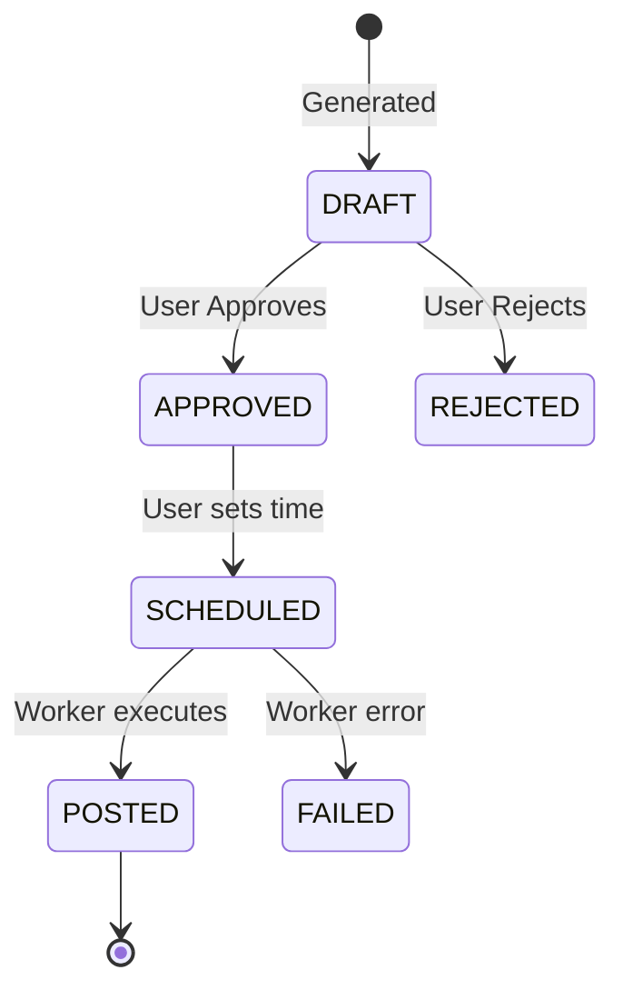

# SocialSprout MVP Specification

## 1. Goals & Non-Goals

### Goals
- **End-to-End Workflow**: Enable small businesses to go from onboarding to scheduled social media posts.
- **Provider Abstraction**: Design a robust interface for generation providers so specific implementations (Freepik/Claude) can be swapped or stubbed without affecting the core app.
- **MVP Reliability**: Ensure the "happy path" (Generate -> Approve -> Schedule) works flawlessly with stubbed data.
- **Platform Expansion**: Structure data to support future platforms (Pinterest) even if only IG/FB are supported now.
- **Monetization**: Integrate x402 for payment/credit management.

### Non-Goals
- **Real-time Posting**: Actual integration with FB/IG APIs is out of scope. We will simulate "posting" via a worker.
- **Payment/Billing**: Out of scope for MVP.
- **Complex Editing**: No image editor or advanced text editing. Just simple approval/regeneration (or manual text tweak if strictly necessary, but simple "approve" is priority).
- **User Ops/Auth**: Simple auth is fine, potentially just stubbed/dev-mode auth for now if not specified otherwise. (Assuming Next.js basics).

## 2. User Flows

### Flow 1: Onboarding & Brand Setup
1. **Landing**: User lands on app.
2. **Create Brand**: User inputs "Brand Name", "Industry" (Category), "Vibe" (StylePreset), and optional "Description".
3. **Save**: Brand is committed to database.

### Flow 2: Campaign Creation
1. **Dashboard**: User sees list of brands. Selects a brand.
2. **New Campaign**: Clicks "New Campaign".
3. **Input**: Enters "Campaign Name" (e.g., "Summer Sale"), "Goal" (e.g., "Drive traffic"), and select "Platforms" (IG/FB).
4. **Create**: Campaign object created.

### Flow 3: Generation & Review
1. **Trigger**: User enters Campaign workspace.
2. **Effect Setup**:
    - **Select Style**: User chooses from presets (UGC, Clean Studio, etc.). Defaults to Brand's style.
    - **Context (Optional)**: User types instructions or uploads `Assets` (product images).
3. **Generate**: User clicks "Generate Drafts".
    - **Payment**: System automatically checks credits/payment method via x402. Deducts usage.
4. **Processing**: System creates `GenerationRun` and calls Provider.
5. **Review**: User sees 3 drafts.
4. **Action**: User can "Approve" a draft or "Reject".
5. **Refinement (Optional)**: User might edit caption text before approving.

### Flow 4: Scheduling & Posting (Simulation)
1. **Schedule**: For an approved post, User selects a date/time.
2. **Confirm**: Status changes to `SCHEDULED`.
3. **Background Job**: A worker (simulated) picks up items past their due date.
4. **Execute**: Worker marks status as `POSTED`.

## 3. Data Entities

### Brand
- `id`: UUID
- `name`: string
- `category`: Enum (LifestyleProduct, ConsumerProduct, Place, Service)
- `style`: Enum (UGC, CleanStudio, WarmLifestyle, Editorial, Minimal, Documentary)
- `description`: text

### Campaign
- `id`: UUID
- `brandId`: UUID
- `name`: string
- `description`: text
- `platforms`: Array<Enum(Instagram, Facebook, Pinterest)>
- `status`: Enum (DRAFT, PAID, COMPLETED)

### Asset
- `id`: UUID
- `brandId`: UUID
- `url`: string
- `type`: Enum (IMAGE)
- `createdAt`: DateTime

### Post
- `id`: UUID
- `campaignId`: UUID
- `status`: Enum (DRAFT, APPROVED, SCHEDULED, POSTED, FAILED)
- `scheduledTime`: DateTime (nullable)
- `content`: JSON
  - `imageUrl`: string
  - `caption`: string
- `platform`: Enum

### GenerationRun
- `id`: UUID
- `campaignId`: UUID
- `inputs`: JSON (snapshot of prompt/params)
- `provider`: string (e.g., "stub-v1")
- `createdAt`: DateTime

## 4. Post Status State Machine

## 5. Error & Fallback Behavior

- **Provider Failure**: If the generation provider throws an error or times out:
  - The UI should show a "Generation Failed" toast.
  - The system should NOT crash.
  - In MVP, since we use stubs, errors should be rare, but if the real provider fails later, we fallback to a "System Unavailable" state or retry.
- **Stub Fallback**: Explicit feature flag or env var `USE_STUBS=true` to force using `StubImageProvider` and `StubTextProvider`.

## 6. MVP Acceptance Criteria (Checklist)

- [ ] Can create a Brand with valid metadata.
- [ ] Can upload an Asset and associate it with a Brand/Campaign.
- [ ] Can initiate x402 payment simulation.
- [ ] Can create a Campaign under a Brand (gated by payment/credits).
- [ ] "Generate" button creates 3 Post drafts using uploaded Assets (mocked usage).
- [ ] Can transition a Post from DRAFT -> APPROVED.
- [ ] Can set specific scheduled time for a Post.
- [ ] Mock worker/endpoint can flip SCHEDULED -> POSTED.

## 7. How to Iterate

To propose changes to the contract:
1. **Modify `docs/spec.md`**: Update the flow or entity definition.
2. **Update `docs/contracts.md`**: Reflect JSON shape changes.
3. **Update `lib/contracts.ts`**: Update Zod schemas.
4. **PR**: Submit Pull Request with "Contract Change" label.
5. **Sync**: Once merged, frontend and backend teams update their types from `lib/contracts.ts`.
